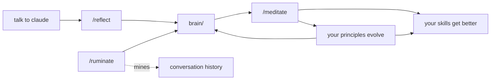

# Brainmaxxing

Stupid simple persistent memory for Claude Code. A markdown vault that your agent reads at session start and writes to when it learns something. It's also an [Obsidian](https://obsidian.md) vault, so you can browse your agent's memory yourself.

Comes with 16 engineering principles as starter content and four skills that form a learning loop: `reflect` after sessions, `ruminate` over past conversations, `meditate` to audit and prune. Two hooks handle the plumbing: injecting the brain index at startup and rebuilding it when files change.

## Usage

**`/reflect`**: Run this at the end of a session, or after Claude makes a mistake and you correct it. It scans the conversation for things worth remembering and writes them to the brain. Most of your brain content will come from this.

**`/meditate`**: Run this after your brain has accumulated some content. It reviews your skills against what's in the brain, finds contradictions, and suggests improvements to them. Also prunes stale notes and surfaces unstated principles hiding across multiple entries.

**`/ruminate`**: Run this occasionally (weekly, monthly, whenever). It digs through your past Claude Code conversations looking for patterns that `/reflect` missed. Corrections you gave, preferences you repeated, knowledge that never got captured. Good for bootstrapping a brain from an existing conversation history.

You don't need to use all three. `/reflect` alone gets you most of the value.

## Installation

Tell Claude Code:

> Install brainmaxxing from https://github.com/poteto/brainmaxxing into this project.

It needs to:

1. Copy `brain/` into the project root (the starter vault)
2. Copy `.agents/skills/` (brain, reflect, ruminate, meditate)
3. Copy `.claude/hooks/` and merge hook config into `.claude/settings.json`
4. Append the brain instructions from `CLAUDE.md` into the project's `CLAUDE.md`

## License

MIT
